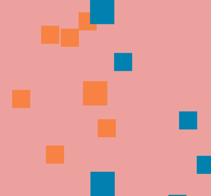

# ICE Collider

 

Visualisation of various **2D collision algorithms** for convex polygons.

---

## Collision Algorithms:

- Axis Aligned Bounding Box (AABB)
  * Each shape gets a rectangular bounding box against a common set of axes. If the bounding boxes overlap, there is a collision.
- Separating Axis Theorem
  * An axis is made for each side of each shape. All the vertices are projected onto this axis and they are tested for overlap between the two shapes. If overlap occurs on every axis, a collision is occuring.
---

## Rebound/Physics Algorithms:

- Non-momentum Rebound
  * Velocity is changed based on relative velocity parallel to the collision direction.
- 'Bad' Rebound
  * Absolute velocity parallel to the collision direction is reversed
